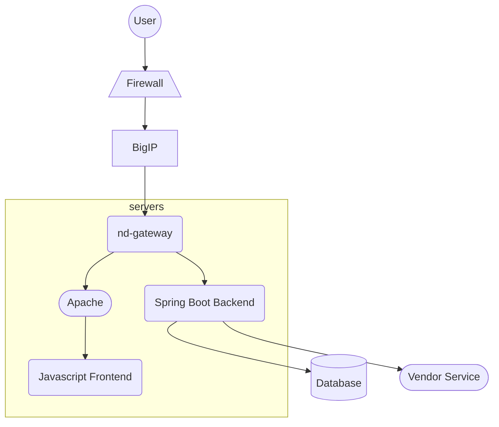

All traffic from the web is encrypted and goes through the firewall and the load balancer (BigIP), where SSL certificates is installed for the different domains
we serve. The ecrypted traffic is terminated on the load balancer.

The load balancer forwards all traffic to our Spring Boot Gateway (nd-gateway) which determines where the traffic is to be routed, either backend or
frontend, based on a set of rules that we maintain.

The frontend applications are all javascript based, mostly React, but also Vue and other stuff.

The backends are Spring Boot applications.

For API calls from the frontend to the backend it will pass through the gateway which use service discovery by Eureka to provide what service and server
is to be used.

The backends can have integrations with different vendor services or databases.

Backend to backend communication is handled through service discovery by Eureka and the gateway.

All applications is hosted on two servers, with two levels of load balancing, first through BigIP, then the gateway.
