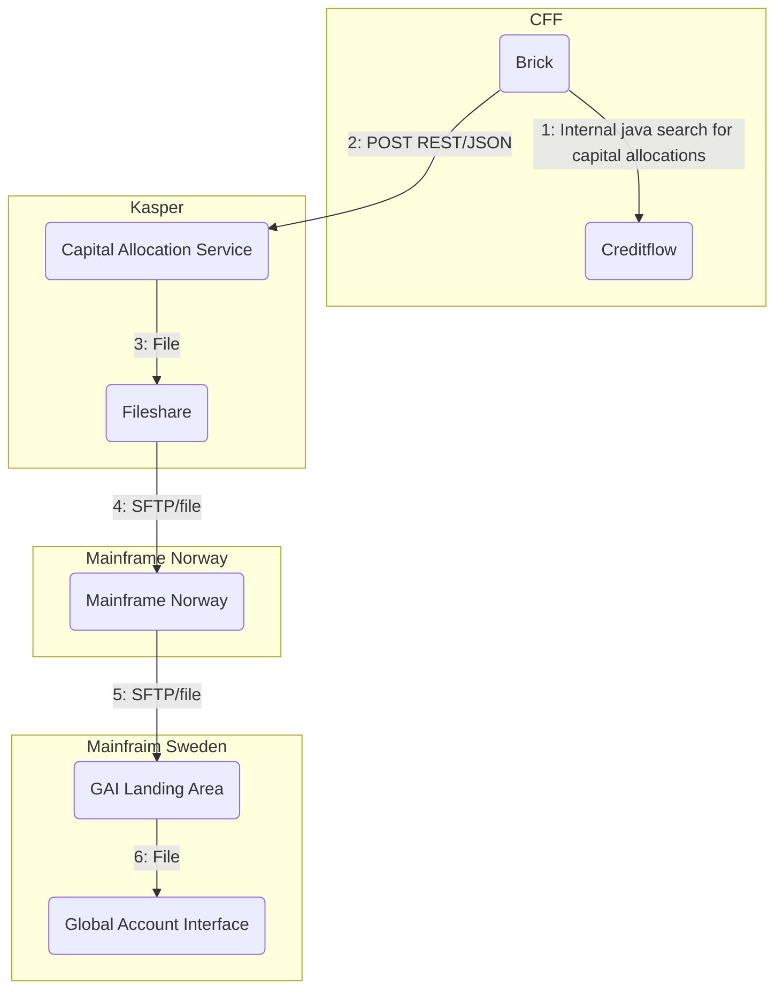
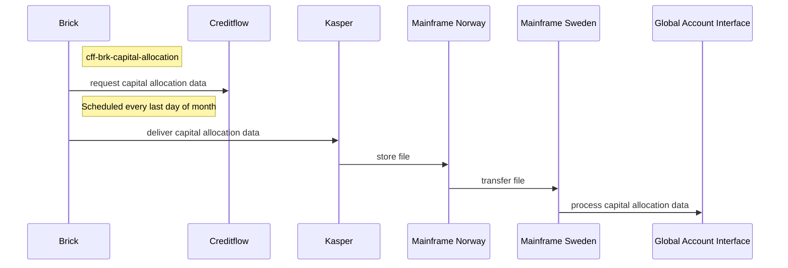

#Capital allocation between CFF and GAI

##Components

```mermaid
flowchart TD
  classDef changes stroke-width:4px
    
  subgraph CFF
    B(Brick)-- 1: Internal java search for capital allocations -->C(Creditflow)
  end
  subgraph Kasper
    B-- 2: POST REST/JSON -->K(Capital Allocation Service)
    K-- 3: File --> KS(Fileshare)
  end 
  subgraph Mainframe Norway
    KS-- 4: SFTP/file -->MN(Mainframe Norway)
  end
  subgraph Mainfraim Sweden 
    MN-- 5: SFTP/file -->GL(GAI Landing Area)
    GL-- 6: File -->G(Global Account Interface)
  end
  
  
```

##Sequence

```mermaid
sequenceDiagram
  participant B as Brick
  participant C as Creditflow    
  participant K as Kasper
  participant MN as Mainframe Norway
  participant MS as Mainframe Sweden
  participant G as Global Account Interface
  Note right of B: cff-brk-capital-allocation
  B->>C: request capital allocation data
  Note right of B: Scheduled every last day of month
  B->>K: deliver capital allocation data
  K->>MN: store file 
  MN->>MS: transfer file 
  MS->>G: process capital allocation data            
```

