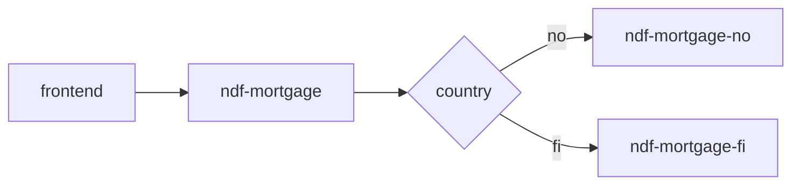

Where @espene-nordea quickly throws together diagrams:

```mermaid
  graph LR
      A[frontend]-->B[ndf-mortgage]
      B-->C{country}
      C-->|no| ndf-mortgage-no
      C-->|fi| ndf-mortgage-fi
```
