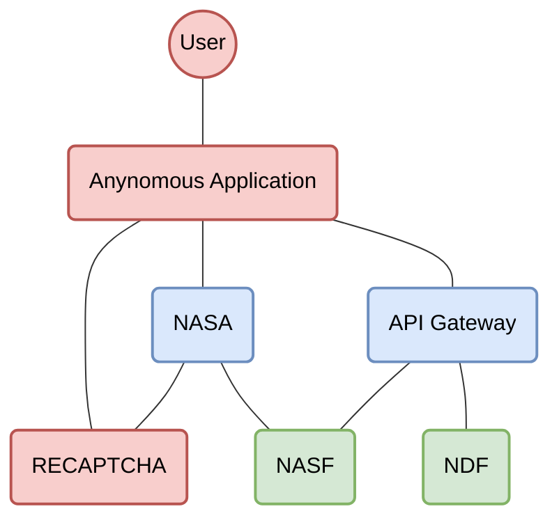
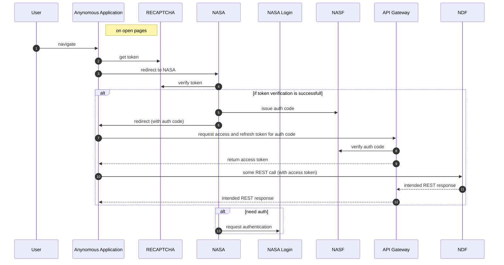

# Unauthenticated access to NDF

## Components

```mermaid
flowchart TD
  classDef default color:black
  classDef red stroke-width:2px,fill:#F8CECC,stroke:#B85450
  classDef blue stroke-width:2px,fill:#DAE8FC,stroke:#6C8EBF
  classDef green stroke-width:2px,fill:#D5E8D4,stroke:#82B366
  
    U((User)) --- AA(Anynomous Application)
    AA --- RC(RECAPTCHA)
    AA --- N(NASA)    
    AA --- G
    N --- RC
    G(API Gateway) --- NASF(NASF)
    N --- NASF   
    G --- NDF(NDF)    
  
  class U,AA,RC red;             
  class N,G blue;             
  class NASF,NDF green;             
```

## Sequence

```mermaid
sequenceDiagram  
  autonumber
  participant U as User
  participant AA as Anynomous Application    
  Note right of AA: on open pages
  participant RC as RECAPTCHA  
  participant N as NASA
  participant NL as NASA Login
  participant NASF 
  participant G as API Gateway
  participant NDF  
  U->>AA: navigate
  AA->>RC: get token
  AA->>N: redirect to NASA
  N->>RC: verify token
  alt if token verification is successfull  
    N->>NASF: issue auth code 
    N->>AA: redirect (with auth code)
    AA->>G: request access and refresh token for auth code  
    G->>NASF: verify auth code
    G-->>AA: return access token  
    AA->>NDF: some REST call (with access token) 
    NDF-->>G: intended REST response            
    G-->>AA: intended REST response
  end 
  alt need auth
    N->>NL: request authentication  
  end         
```

